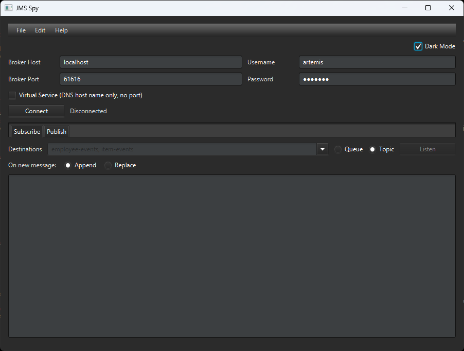

# 📄 jms-spy



## 🛠️ Build instructions

Build and run (Maven wrapper is not present; use system `mvn`):

- Build: `mvn clean package`
- Run the JavaFX app: `mvn spring-boot:run`
- Run all tests: `mvn test`
- Run a single test class: `mvn test -Dtest=MainApplicationTests`
- Run a single test method: `mvn test -Dtest=MainApplicationTests#givenApplicationContextIsLoadedThenJmsConnectionServiceShouldNotBeNull`

Package a standalone Windows executable (requires a full JDK 14+, not just a JRE — `jlink` needs the `jmods` directory — run from repo root in PowerShell):
```
.\jpackage.ps1
```
This produces `target\dist\JmsSpy\JmsSpy.exe` (no console) and `target\dist\JmsSpy\JmsSpy_with_Console.exe` (with console). Both are fully self-contained and run on a machine with no Java installed. The script builds the jar, copies runtime dependencies (dropping Lombok, which is compile-time only) into `target\jpackage-input`, then runs `jdeps --print-module-deps` against the assembled jar/dependencies to compute the minimal set of JDK modules this app actually uses, adds `jdk.crypto.ec` unconditionally (it's needed for TLS but only pulled in via SPI/reflection at runtime, so `jdeps` can't see it), feeds that module list to `jlink` to build a custom runtime image at `target\runtime`, and finally invokes `jpackage --runtime-image target\runtime` with two launchers sharing one app image.

## 🚀 Usage instructions

1. **Connect** — enter the broker host and port (defaulting to `61616`, Artemis's own default), and optionally a username/password, then click **Connect**. On first run (no `~/.jms-spy/config.properties` yet), host/port/username default to the `SPRING_ARTEMIS_BROKER_URL`/`SPRING_ARTEMIS_USER`/`SPRING_ARTEMIS_PASSWORD` env vars if set — the same ones `item-server`/`employee-server` use (see the root repo's `docker-compose.yml`/Helm charts) — and are left blank (port `61616`) otherwise. Check **Virtual Service** if Artemis is only reachable by a single DNS host name with no separate port for either protocol it exposes (e.g. behind a Kubernetes Service/ingress) — this disables and ignores the Broker Port field (and the Jolokia Port field in Edit -> Settings), connecting on Artemis's standard port under the hood without you needing to know or type it.
2. Pick the **Subscribe** or **Publish** tab. Both tabs' destination fields are editable drop-downs: type a name freely, or pick one from the list, which is populated from the broker's own address list (via Jolokia, Artemis's HTTP management API) right after a successful Connect.
   - **Subscribe** — enter one or more comma-separated destination names (e.g. `employee-events, item-events`), choose **Queue** or **Topic** (applies to all of them), then click **Listen** to start consuming all of them at once. Incoming messages are shown in the text area prefixed with which destination they came from (e.g. `[employee-events] { ... }`), either appended (default) or replacing the previous message, per the radio toggle.
   - **Publish** — enter a destination name and type, type a message body in the text area, then click **Publish** to send it as a `TextMessage`. Useful for triggering test events without going through `item-server`/`employee-server`'s REST APIs.
   - Both tabs share the same connection but have independent destination name/type fields, so you can e.g. subscribe to one destination while publishing test messages to another.
   - `item-server` and `employee-server` both publish to plain JMS **queues** (`item-events`, `employee-events` — see each server's `app.jms.*` property), so leave **Queue** selected to interoperate with either one.
   - Picking the wrong type doesn't error — it just silently doesn't connect the two sides, since Artemis routes queue-sent messages only to queue consumers and topic-sent messages only to topic consumers, even on the same destination name.
3. **Dark Mode** — the checkbox in the top-right corner swaps between `light-theme.css` and `dark-theme.css`, applied to the whole window immediately.
4. **Edit -> Settings** — opens a dialog to override the Jolokia port (default `8161`), path (default `/console/jolokia`), and address-search MBean pattern used when populating the destination drop-downs, for brokers whose management console isn't on the default port/path. The Jolokia Port field is disabled here too when **Virtual Service** is checked on the main screen. Click **OK** to save, or **Cancel** to discard.
5. Broker host/port, username, Virtual Service, both tabs' destination name/type, append/replace choice, dark mode, and the Jolokia settings are remembered between runs (see `UserPreferencesStore` below); the password is never saved and must be re-entered each session.

## ⚙️ Architecture

This is a Spring Boot + JavaFX desktop app (Java 21) that connects to an Apache ActiveMQ Artemis broker and displays messages received on a JMS queue or topic. All source lives under the single package `com.example.jfx.spring.jms`.

Spring Boot manages the application context; JavaFX drives the UI. They're bridged in [JavaFxApplication.java](src/main/java/com/example/jfx/spring/jms/JavaFxApplication.java):
- `MainApplication.main` calls `Application.launch(JavaFxApplication.class, ...)` — JavaFX owns the entry point, not `SpringApplication.run`.
- `JavaFxApplication.init()` boots a Spring context (`WebApplicationType.NONE`) and registers the JavaFX `Application`, `Parameters`, and `HostServices` as beans so Spring-managed components can depend on them.
- `JavaFxApplication.start(Stage)` doesn't build UI directly — it publishes a `StageReadyEvent` (an inner class of `JavaFxApplication`) through the Spring context once the primary `Stage` is available.
- `PrimaryStageInitializer` listens for `StageReadyEvent`, loads `primary.fxml` (the single, only screen), and sets it as the primary `Stage`'s scene. `FXMLLoader.setControllerFactory` is wired to `applicationContext::getBean`, so `PrimaryController` is constructed via Spring DI.

JMS connectivity lives in [JmsConnectionService.java](src/main/java/com/example/jfx/spring/jms/JmsConnectionService.java): a `@Component` that owns one `Connection`/`Session` and a *list* of `MessageConsumer`s at a time, built directly against the Artemis client API (`org.apache.activemq.artemis.jms.client.ActiveMQConnectionFactory`, `jakarta.jms.*`) rather than Spring's JMS auto-configuration — the broker URL, credentials, destination names, and destination type ([DestinationType.java](src/main/java/com/example/jfx/spring/jms/DestinationType.java): `QUEUE` or `TOPIC`, applied uniformly to every destination in the list) are all supplied at runtime from the UI, not fixed at startup. `listen(List<String>, DestinationType, MessageListener)` creates one consumer per destination name, all sharing the same listener, and rolls all of them back (via `stopListening()`) if any single `createConsumer` call fails partway through, so a typo in one destination name doesn't leave a half-subscribed state. `connect()`/`disconnect()` and `listen()`/`stopListening()` are independent: you must be connected before you can listen, and reconnecting tears down any active consumers first. `@PreDestroy` ensures the connection is closed when the Spring context shuts down. `publish(destinationName, destinationType, body)` is stateless by comparison — it opens a `MessageProducer` in a try-with-resources block, sends one `TextMessage`, and closes it, since there's no ongoing publish session to track the way `listen`/`stopListening` track consumers. (Publish only targets one destination at a time — the multi-destination list is a Subscribe-tab-only feature.)

`PrimaryController.parseDestinationList` splits the Subscribe tab's destination field on commas, trims whitespace, and drops empty entries, so `employee-events, item-events` (or a stray trailing comma) both work. Since multiple destinations now feed the same message area, `onMessageReceived` labels each line with its source via `Message.getJMSDestination()` (cast to `Queue`/`Topic` to read the name back out) rather than showing raw content alone — otherwise messages from different destinations would be indistinguishable once they land in one text area.

`primary.fxml`'s root has a `TabPane` with two tabs, **Subscribe** (the original destination/Listen/append-replace/message-area controls) and **Publish** (its own destination name/type fields, a message-body `TextArea`, and a Publish button/status label) — both call into the same `JmsConnectionService`/`Connection`, so a single Connect covers both tabs.

Both tabs' destination fields (`destinationCombo`, `publishDestinationCombo`) are editable `ComboBox<String>`es rather than plain `TextField`s, so a destination name can be typed freely (including Subscribe's comma-separated list) or picked from a dropdown of addresses known to the broker. [JolokiaClient.java](src/main/java/com/example/jfx/spring/jms/JolokiaClient.java) supplies that list: on a successful connect, `PrimaryController.refreshDestinationList` derives a Jolokia URL from the broker URL's hostname (Jolokia is Artemis's HTTP management API, normally on a different port/path than the JMS broker URL, so `deriveJolokiaUrl` can't reuse the broker port) combined with the user-configurable Jolokia port/path, and calls `searchAddresses`, which hits Jolokia's `/search/<mbean-pattern>` endpoint with the (also user-configurable) address-MBean search pattern and regexes the `address="..."` attribute out of each returned canonical MBean name. The same username/password entered for the JMS connection are sent as an HTTP Basic `Authorization` header (only when a username is present, matching `JmsConnectionService.connect`'s own anonymous-vs-authenticated branch) - Artemis's Jolokia endpoint sits behind the same broker credentials, so there's no separate login for it. This runs off the JavaFX thread via `CompletableFuture.supplyAsync` since it's a network call; a failure is logged and swallowed rather than surfaced, since the combo boxes stay freely editable either way. Because the combo boxes are editable, code that needs the literal typed text (parsing Subscribe's comma list, reading Publish's destination, saving preferences) reads `getEditor().getText()` rather than `getValue()`, which only updates on commit (Enter/selection/focus-lost).

The Jolokia port, path, and address-search MBean pattern are user preferences rather than fixed constants: `JolokiaClient.DEFAULT_JOLOKIA_PORT`/`DEFAULT_JOLOKIA_PATH`/`DEFAULT_ADDRESS_SEARCH_MBEAN` are package-visible only to supply defaults to `JmsSpyPreferences.defaults()` and `UserPreferencesStore` (when no saved value exists yet); the live values are held as plain fields on `PrimaryController` (not FXML-bound), loaded from preferences in `initialize()` and used by `refreshDestinationList`. Edit -> Settings (`PrimaryController.showSettingsDialog`) opens a modal `Dialog<ButtonType>` built programmatically (not from FXML, since it's a one-off popup rather than part of the main scene) with a `TextField` per setting, pre-filled with the current in-memory values; OK parses the port (falling back to `DEFAULT_JOLOKIA_PORT` on a non-numeric entry) and calls the same `savePreferences()` used elsewhere, so the change persists immediately like any other preference. Cancel (or closing the dialog) discards the edits without touching the fields.

`virtualServiceCheckBox` ("Virtual Service (DNS host name only, no port)") lives on the main screen, next to Broker Host/Port, rather than inside the Jolokia settings dialog - it covers Artemis being fronted by a Kubernetes Service/ingress or similar single DNS name with no separately-reachable port for *either* protocol Artemis exposes, not just Jolokia's HTTP management API. Checking it disables `brokerPortField` (bound via a listener on the checkbox's `selectedProperty`, same wiring pattern as `darkModeCheckBox`) and, when `showSettingsDialog` builds its Jolokia Port `TextField`, that field's initial `setDisable` mirrors the same outer checkbox state rather than owning a second, independent toggle. The two ports are affected differently, though, because HTTP and raw TCP disagree on whether "no port" is even meaningful: `JolokiaClient.deriveJolokiaUrl(brokerHost, port, path, virtualService)` genuinely omits the port from the derived `http://` URL, since HTTP has a real, universally-understood default port (80) that the JDK's own URL/HTTP stack applies automatically. Plain TCP has no such convention - confirmed by constructing `new ActiveMQConnectionFactory("tcp://host")` and inspecting its parsed `TransportConfiguration`, which stores an explicit `port=-1` rather than defaulting it to Artemis's own standard port - so `PrimaryController.toggleConnection` can't just leave the port out of the `tcp://` URL string the way it can for Jolokia's `http://` URL; instead, when the checkbox is selected it substitutes `JmsSpyPreferences.DEFAULT_BROKER_PORT` (`61616`) explicitly, so the user still never has to know or type a port, but the connector always receives one.

[PrimaryController.java](src/main/java/com/example/jfx/spring/jms/PrimaryController.java) wires the UI to `JmsConnectionService`: the Connect/Listen buttons toggle their own state by asking the service `isConnected()`/`isListening()` rather than tracking duplicate state; the Publish button is simply enabled/disabled alongside Listen based on connection state, since publishing doesn't have its own persistent "is publishing" state to track. Incoming messages arrive on a JMS provider thread, so `onMessageReceived` always hands off to `Platform.runLater` before touching the `TextArea`; the append-vs-replace radio buttons decide whether that update appends or calls `setText`.

The Dark Mode checkbox drives `PrimaryController.applyTheme(boolean)`, which swaps `rootPane.getStylesheets()` between `/light-theme.css` and `/dark-theme.css` (both plain CSS files under `src/main/resources`, overriding JavaFX's default Modena `-fx-base`/`-fx-background`/`-fx-text-fill`/`-fx-accent`). `rootPane` (the top-level `VBox`, given an `fx:id` in `primary.fxml`) is used instead of the `Scene`'s own stylesheet list because at `initialize()` time — where the saved theme preference needs to be applied — the FXML's root node exists but hasn't been attached to a `Scene` yet (`PrimaryStageInitializer` creates the `Scene` only after `FXMLLoader.load()` returns); `Parent.getStylesheets()` works regardless of scene attachment, so it doesn't matter that it's set before a `Scene` exists.

User choices (broker URL, username, subscribe destination name/type, append/replace mode, dark mode, publish destination name/type) are persisted by [UserPreferencesStore.java](src/main/java/com/example/jfx/spring/jms/UserPreferencesStore.java) to `~/.jms-spy/config.properties` (a plain `java.util.Properties` file, not the classpath `application.properties`) and reloaded into the form on `PrimaryController.initialize()`. The password field is intentionally never persisted — it must be re-entered each session. The message body typed into the Publish tab is not persisted either — only its destination name/type are. Preferences are saved on successful connect/listen/publish and whenever the destination-type, display-mode, or dark-mode toggles change.

The Connect row's Broker URL field is split into separate `brokerHostField`/`brokerPortField` `TextField`s (`brokerHost: String`/`brokerPort: int` in `JmsSpyPreferences`) rather than one free-text URL, since Artemis's own TCP URL scheme (`tcp://host:port`) always takes the same shape here - `PrimaryController.toggleConnection` recomposes `"tcp://" + host + ":" + port` before handing it to `JmsConnectionService.connect`. `JmsSpyPreferences.parseBrokerHost`/`parseBrokerPort` (via `java.net.URI`) pull host/port back out of a `tcp://host:port` string in two places: `defaultBrokerHost()`/`defaultBrokerPort()` when reading the `SPRING_ARTEMIS_BROKER_URL` env var, and `UserPreferencesStore.resolveBrokerHost`/`resolveBrokerPort`, which fall back to parsing a legacy single `brokerUrl` config-file key (from before this split) if the newer `brokerHost`/`brokerPort` keys aren't present yet - so upgrading doesn't silently lose a previously-saved broker. `DEFAULT_BROKER_PORT` (`61616`, Artemis's own default) is used whenever no port can be determined from any source.

When no config file exists yet — first run, or a fresh machine — `JmsSpyPreferences.defaults()` and `PrimaryController` fall back to the `SPRING_ARTEMIS_BROKER_URL`/`SPRING_ARTEMIS_USER`/`SPRING_ARTEMIS_PASSWORD` env vars (blank if unset, port defaulting to `61616`) for broker host/port, username, and password respectively, rather than a hardcoded broker URL. This mirrors the env var names `item-server`/`employee-server` already read for their own Artemis connections, so pointing jms-spy at the same broker (e.g. the KinD cluster's TCP passthrough on `localhost:61616`) needs no retyping if those vars are already exported in the shell. `UserPreferencesStore.hasSavedConfig()` is what gates this — once a config file is saved, its own `brokerHost`/`brokerPort`/`username` values take over and the env vars stop applying (password is still never read from the file, but also isn't re-defaulted from the env once a config file exists).

Static UI configuration (window title/size, initial FXML view) is typed via `AppProperties` ([AppProperties.java](src/main/java/com/example/jfx/spring/jms/AppProperties.java)), a `@ConfigurationProperties("app")` record bound from `application.properties`. `@ConfigurationPropertiesScan` on `MainApplication` discovers it automatically — no explicit `@EnableConfigurationProperties` needed. Don't confuse this with `UserPreferencesStore`'s external config file — `AppProperties` is fixed at build time, the preferences file is mutable at runtime.

Lombok is used for boilerplate (`@Slf4j`, `@RequiredArgsConstructor`, `@SneakyThrows`, `val`) but is excluded from the packaged app in both the Spring Boot Maven plugin config (`pom.xml`) and `jpackage.ps1`, since it's compile-time only.

The `artemis-jakarta-client-all` dependency version is pinned explicitly via the `artemis.version` property — Spring Boot 3.2.0's parent BOM does not manage this artifact's version.

`jackson-databind` is a plain, unversioned dependency (managed by the `spring-boot-starter-parent` BOM) added solely so `JolokiaClient` can parse Jolokia's JSON responses — `spring-boot-starter` alone doesn't pull Jackson in.
